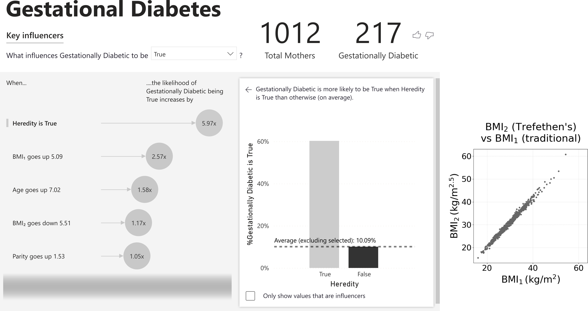

# Styling Microsoft Power BI dashboards with TeX

This repository holds digital assets associated with the article "Styling
Microsoft Power BI dashboards with TeX" [[1](#references)]. That article
describes how TeX may be used in Power BI to style business intelligence
dashboards. A gestational diabetes dataset was used to demonstrate both
desktop, and cloud-based, TeX-styled dashboard rendering.

---

<figure>
  
  <figcaption>Figure 1. TeX-styled Power BI dashboard for a gestational diabetes dataset. Adapted from [<a href="#references">1</a>].</figcaption>
</figure>

---

## Table of Contents

- [Key Files](#key-files)
- [Software Requirements](#software-requirements)
- [Getting Started](#getting-started)
- [References](#references)

## Key Files

| File                          | Notes               |
| :---------------------------- | :------------------ |
| `src/GreyNeutralTheme.json`   | Power BI theme.     |
| `src/TexStyledDashboard.pbix` | Power BI dashboard. |

The Power BI dashboard holds native visuals and a Matplotlib scatterplot. An
example gestational diabetes dataset is embedded. The scatterplot showcases
TeX-styling visuals compatible with both local (Power BI Desktop) and online
(Power BI) rendering. The accompanying grey-based theme provides accessibility
to colour-blind users.

## Software Requirements

| Software                   | Notes                                                                                                                                                              |
| :------------------------- | :----------------------------------------------------------------------------------------------------------------------------------------------------------------- |
| Power BI\* &nbsp;       | [Details here](https://www.microsoft.com/en-au/power-platform/products/power-bi). Free and fee-based options available. &nbsp;&nbsp;&nbsp;For online rendering. |
| Power BI Desktop &nbsp; | [Details here](https://www.microsoft.com/en-au/power-platform/products/power-bi/desktop). Free. &nbsp;&nbsp;&nbsp;For local rendering.                          |
| Python &nbsp;           | [Available here](https://www.python.org/). Free. &nbsp;&nbsp;&nbsp;For local rendering.                                                                         |

\* The associated article [[1](#references)] makes reference to the "Power BI
Service". At the time of publication, the Power BI Service was a standalone
service. It's now part of Microsoft Fabric and referred to as simply, "Power
BI".

### Python Configuration

As the dashboard uses Python-enabled visuals, Power BI should be configured to
execute Python. To do this, via the Power BI Desktop left-hand navigation menu,
go to:

- Options and settings -> Options -> Global -> Python scripting.
- Specify a valid path to the home directory of a Python installation.

Please ensure the Python environment has the following packages installed:

- matplotlib.
- pandas.

## Getting Started

### Local Rendering

For local dashboard rendering, open `TexStyledDashboard.pbix` with Power BI
Desktop.

### Online Rendering

For online dashboard rendering, open `TexStyledDashboard.pbix` from Power BI.

## References

1. T. Stenborg, "Styling Microsoft Power BI dashboards with TeX", _TUGboat_,
   vol. 46, no. 1, pp. 156&ndash;157, Apr. 2025, doi:
   10.47397/tb/46-1/tb142stenborg-powerbi.\
   [View PDF](https://tug.org/TUGboat/tb46-1/tb142stenborg-powerbi.pdf) &nbsp;
   [View at publisher](https://tug.org/TUGboat/tb46-1/tb142stenborg-powerbi.html)
   &nbsp; [SciX](https://scixplorer.org/abs/2025TUGbt..46..156S/abstract)
